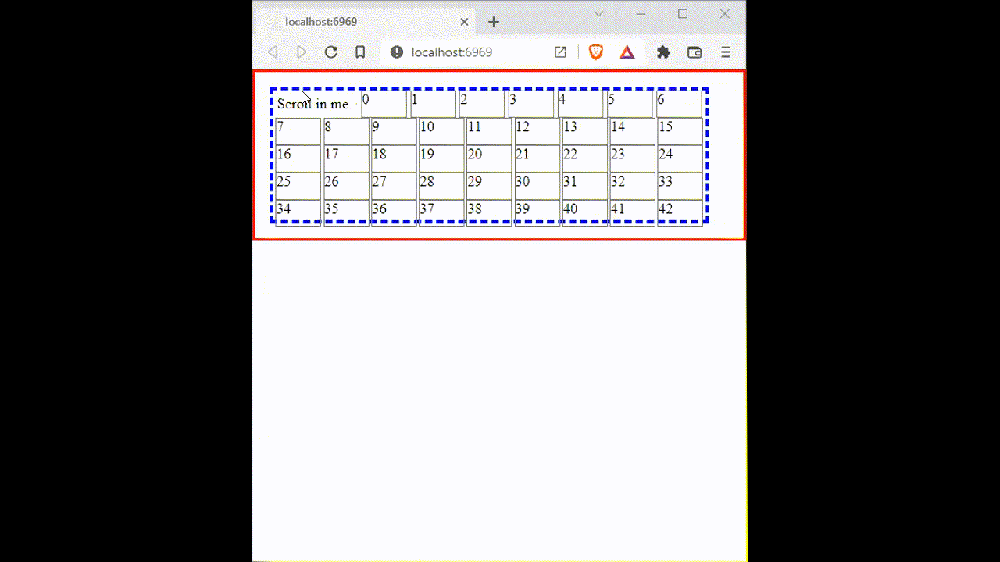

# HTML Node Element Zoom, available as a Svelte Directive

Zero dependencies. Use as vanilla JS or add this as a Svelte action directive to the node you want to zoom in on. Not just images... _any_ html elements.



## As Svelte Action Directives

Svelte action directives are neat. They attach some javascript at the html level, it's a shortcut that saves a lot of repeated code.

[https://svelte.dev/docs#template-syntax-element-directives-use-action](https://svelte.dev/docs#template-syntax-element-directives-use-action)

## Demo

Demo code is in `src/index.svelte`

Repo Demo: [https://douganderson444.github.io/panzoom-node/](https://douganderson444.github.io/panzoom-node/)

REPL is [https://svelte.dev/repl/9a9571ea3590430690d3a0c809bb7eb3](https://svelte.dev/repl/9a9571ea3590430690d3a0c809bb7eb3)

## Use

```js
<script>
 import { panzoom } from "@douganderson444/panzoom-node";
</script>

<div class="optional-container" >

	Pan in me.

	<div class="zoomable" use:panzoom>
		Scroll on me.
	</div>

</div>
```

## Vanilla JavaScript / other frameworks use

You could also use this in vanilla javascript, just pass the html node you wish to apply the panzoom to into the function:

```js
import { panzoom } from '@douganderson444/panzoom-node';

const element = document.createElement('p');
const node = document.createTextNode('This is new.');
element.appendChild(node);

// apply panzom to the node
panzoom(node);
```

## Optional Zoom Container

The zoomable HTML node will be contained within the parent element as a container. If no container is set, it will use the parent element as the default container, using the `<body>` as the container if there's no parent element.
